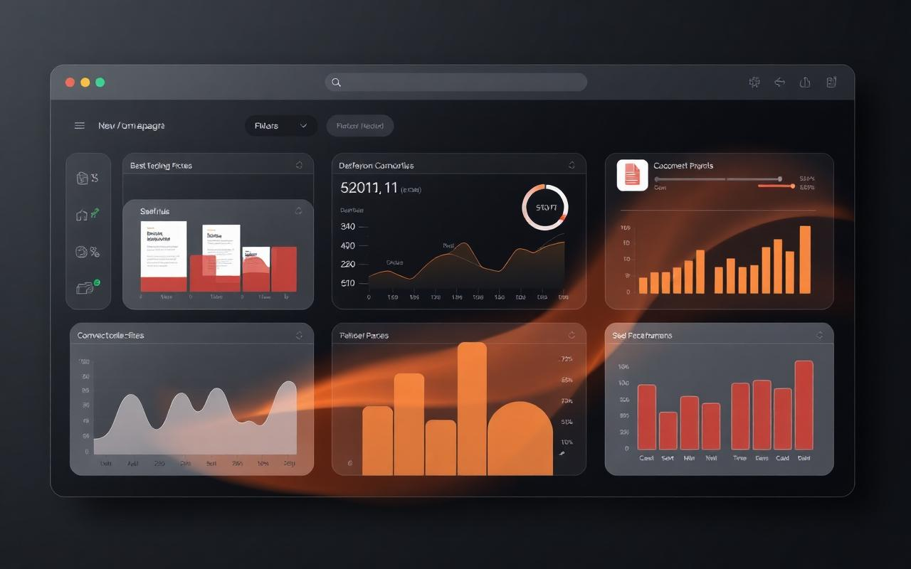

# Bento Portfolio

A modern, responsive **bento grid developer portfolio template**. Free and open source — clone it, edit one file, deploy.

It looks like a product landing page rather than a résumé site: mixed-size bento cards, warm editorial palette, restrained motion, light/dark themes, and all content driven from a single typed config file.



> Replace the screenshot above with a real capture of your deployed site.

## Features

- Bento grid layout with mixed card sizes (hero, profile, GitHub, skills, currently building, featured project, experience, about, open source, education, résumé, contact)
- Single source of truth: all content lives in `src/data/portfolio.ts`
- Working project filtering by technology
- Light / dark theme with system preference + persistence, no flash on load
- Design tokens only — no hard-coded colors in components
- Subtle animations: card entrance stagger, hover elevation, image zoom; respects `prefers-reduced-motion`
- Accessible: semantic landmarks, labelled sections, keyboard focus rings, image alt text
- Responsive at 1440 / 1024 / 768 / 390 px with no horizontal scrolling
- Static frontend only — no backend, no database, no API keys

## Tech stack

React 19 · TypeScript · Vite · TanStack Router · Tailwind CSS v4 · shadcn/ui primitives · Lucide icons

## Installation

```bash
git clone <repository-url>
cd bento-portfolio
npm install
npm run dev
```

Then open the printed local URL. Build with `npm run build`.

## Customization

**Everything personal lives in one file: [`src/data/portfolio.ts`](src/data/portfolio.ts).**

| What you want to change | Where |
| --- | --- |
| Name, role, bio, location, email, years of experience | `portfolio.personal` |
| Availability badge (`● Available for opportunities`) | `personal.available`, `personal.availabilityLabel` |
| Profile photo | replace `public/images/avatar.jpg` (or set `personal.avatar`) |
| Résumé PDF | drop `public/resume.pdf`; set `personal.resume: ""` to hide the card |
| GitHub / LinkedIn / website | `portfolio.social` |
| GitHub stats + activity squares | `portfolio.github` (static values, no API needed) |
| Skills and categories | `portfolio.skills` |
| Currently building card | `portfolio.currentlyBuilding` |
| Projects (set `featured: true` for the big bento card) | `portfolio.projects` |
| Project filter chips | `projectFilters` |
| Work history | `portfolio.experience` |
| Education | `portfolio.education` |
| Open-source repos | `portfolio.openSource` |
| Footer template credit | `portfolio.template` |
| Nav items | `navLinks` |

**Colors, fonts, radius, shadows:** `src/styles.css`. Edit the tokens in `:root` (light) and `.dark` (dark) — for example `--brand` for the accent color. Fonts are loaded in `src/routes/__root.tsx` and mapped to `--font-display` / `--font-sans` / `--font-mono`.

Project images go in `public/images/` and are referenced by path, so you never need to touch a component.

## Folder structure

```text
src/
├── data/portfolio.ts        # ← edit this
├── components/              # Header, BentoCard, HeroCard, ProfileCard, SkillsCard,
│                            # GithubCard, ProjectCard, ExperienceCard, EducationCard,
│                            # OpenSourceCard, ResumeCard, ContactCard, Footer, ThemeToggle
├── sections/                # BentoGrid, ProjectsSection
├── routes/                  # index.tsx (page) and __root.tsx (document shell)
└── styles.css               # design tokens, utilities, animations
public/
├── images/                  # avatar + project previews
└── resume.pdf               # your résumé (optional)
```

## Deployment

- **Vercel / Netlify** — import the repo; build `npm run build`, output detected automatically.
- **Any static host** — serve the build output directory.
- **GitHub Pages** — build, then publish the output directory (e.g. via a `gh-pages` action).

## License

MIT — use it, fork it, ship it. Attribution appreciated but not required.
